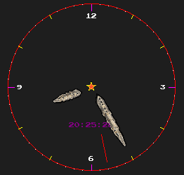

# aClock
A little rudementary Analog clock made with the olcPixelGameEngine 
Transparancy only in Windows at the time of writing.  
  
Made with the fantastic PixelGameEngine (JavidX9) 
<a href="https://github.com/OneLoneCoder/olcPixelGameEngine">https://github.com/OneLoneCoder/olcPixelGameEngine</a> 
<a href="https://www.youtube.com/c/javidx9">https://www.youtube.com/c/javidx9</a> 
 
 
- Dragoneye
